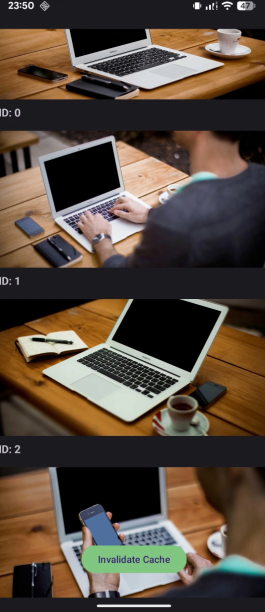
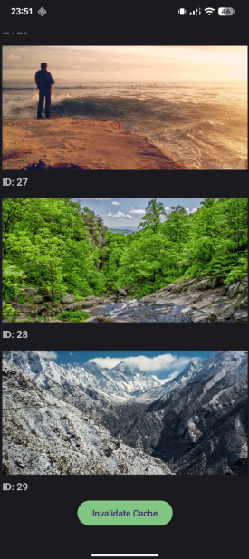
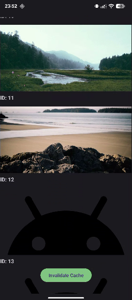

# Android Image Loader & Demo Application

A high-performance, custom-built Android image loading library and a demonstration application. This project showcases efficient bitmap handling, dual-layer caching, and a robust MVVM architecture designed for smooth scrolling in heavy-media environments.

---

## Project Overview

This project was developed as part of a technical assignment to demonstrate expertise in Android core concepts without relying on established libraries like Glide or Coil. It consists of two distinct Gradle modules:

1.  **`imageloader`**: A lightweight Android library module providing a Java-friendly API for asynchronous image loading, caching, and downsampling.
2.  **`app`**: An example application implementing the MVVM pattern to fetch and display a list of high-resolution images using the custom library.

---

## Features

-   **Custom Image Loader Engine**: Built from scratch using modern Kotlin best practices.
-   **Kotlin Coroutines**: fully asynchronous pipeline with non-blocking I/O.
-   **Dual-Layer Cache**:
    *   **Memory Cache**: Fast access using `LruCache`.
    *   **Disk Cache**: Persistent storage in the internal cache directory with MD5 hashed filenames.
-   **Cache Policies**: Automatic 4-hour expiration and manual cache invalidation.
-   **Smart Request Deduplication**: Prevents redundant network requests by sharing a single download task across multiple `ImageView` callers.
-   **RecyclerView Optimization**: Prevents image flickering and memory leaks by cancelling outdated jobs for recycled views using `WeakHashMap`.
-   **Efficient Decoding**: Automatic image downsampling based on target `ImageView` dimensions to minimize RAM usage.
-   **UX Enhancements**: Placeholder support and smooth 300ms fade-in animations for a polished look.
-   **Architecture**: Clean MVVM implementation using Retrofit, LiveData, and ViewBinding.
-   **Unit Tests**: Comprehensive test suite covering business logic and edge cases.

---

## Project Structure

.
├── app/                        # Example Application Module
│   ├── model/                  # Data classes (ImageItem)
│   ├── network/                # Retrofit API definitions
│   ├── repository/             # Data source management
│   ├── ui/                     # Activity and RecyclerView Adapter
│   └── viewmodel/              # State management for the UI
├── imageloader/                # Library Module
│   ├── cache/                  # MemoryCache and DiskCache implementations
│   ├── downloader/             # OkHttp network layer
│   ├── loader/                 # Public API (ImageLoader.load)
│   └── utils/                  # Hashing, Bitmap, and Time utilities
└── gradle/                     # Version catalog and build configuration

---

## Architecture

### Application Layer (MVVM)
The application follows a strictly decoupled architecture, ensuring testability and maintainability.

Activity (UI)
    │
    ▼
ViewModel (State)
    │
    ▼
Repository (Data)
    │
    ▼
Retrofit API (Network)

### Library Engine
The `ImageLoader` acts as a facade, orchestrating data flow between caches and the network on the `IO` dispatcher before delivering the result to the `Main` thread.

ImageLoader.load()
      │
      ├── Check Memory Cache (Instant return)
      │
      ├── Check Disk Cache (Verify < 4h age)
      │
      └── Network Download (Deduplicated via Deferred)

---

## Image Loading Process

1.  **Display Placeholder**: The library immediately sets the placeholder drawable on the `ImageView`.
2.  **Memory Check**: If the bitmap is in the `LruCache`, it is displayed immediately (no animation).
3.  **Job Management**: Any previous pending task for the specific `ImageView` is cancelled.
4.  **Disk Check**: If found on disk and younger than 4 hours, it is decoded on a background thread.
5.  **Deduplicated Download**: If not cached, the library checks for an active download of the URL. If one exists, it awaits it; otherwise, it starts a single OkHttp request.
6.  **Downsampling**: The bitmap is decoded using `inSampleSize` to match the display size.
7.  **Display & Animate**: The bitmap is assigned to the view on the UI thread with a smooth fade-in.

---

## Cache Strategy

| Strategy | Implementation | Description |
| :--- | :--- | :--- |
| **Memory** | `LruCache<String, Bitmap>` | Uses 1/8th of available application memory to store bitmaps. |
| **Disk** | Internal Files | Persists images as PNGs with MD5-hashed names. |
| **Expiration** | 4 Hours | Checks `lastModified` timestamp during the disk read phase. |
| **Deduplication**| `ConcurrentHashMap` | Stores `Deferred<Bitmap>` jobs to ensure one request per URL. |
| **Invalidation** | Manual | `ImageLoader.clearCache()` wipes both layers instantly. |

---

## Technologies Used

| Category | Tool |
| :--- | :--- |
| **Language** | Kotlin |
| **Asynchrony** | Coroutines & Flow/LiveData |
| **Network** | Retrofit 2, OkHttp 4 |
| **Parsing** | Gson |
| **UI** | Android Views (XML), ViewBinding, ConstraintLayout |
| **Testing** | JUnit 4, MockK, Robolectric |
| **Linting** | ktlint (Android Style) |

---

## Building the Project

1.  **Clone the repository**:
        git clone https://github.com/your-repo/image-loader-assignment.git
    
2.  **Open in Android Studio**: Select the root folder and wait for Gradle synchronization.
3.  **Sync Gradle**: Ensure all dependencies are downloaded via the Version Catalog.
4.  **Run**: Press `Shift + F10` or click the **Run** button to deploy to an emulator or physical device.

---

## Running the Application

Upon launch, the app fetches a JSON list of images from a mock endpoint.
-   **Scrolling**: Scroll rapidly to see smooth performance and optimized downsampling.
-   **Loading States**: Observe the grey placeholders and subsequent fade-in transitions.
-   **Invalidate Cache**: Click the "Invalidate Cache" button to clear local storage and trigger fresh downloads.

---

## Testing

The project includes unit tests that mock the network and Android environment:
-   **Cache Logic**: Verifies expiration edge cases (exactly 4 hours vs 4 hours + 1 second) using a mock `TimeProvider`.
-   **Repository**: Validates that network errors are converted into `Result.failure` gracefully.
-   **ViewModel**: Tests state changes in `isLoading`, `images`, and `error` LiveData.

**Run tests via terminal**:
./gradlew test

---

## Performance Optimizations

-   **Memory Footprint**: By calculating `inSampleSize` before decoding, the app avoids OOM (Out Of Memory) errors common when loading high-res images in small list items.
-   **Thread Confinement**: Decoding and network operations never touch the UI thread, ensuring zero frame drops.
-   **Weak References**: Prevents memory leaks by ensuring the `ImageLoader` doesn't hold strong references to `ImageViews`.

---

## Future Improvements

-   **Prefetching**: Logic to load adjacent list items before they scroll into view.
-   **Configurable Policies**: Allow developers to set custom expiration times and cache sizes.
-   **Transformations**: Built-in support for circle-crop or rounded corners.
-   **Progress Indicators**: Real-time download percentage tracking.

---

## Screenshots

| Image List | Loading / Animation | Cache Cleared |
|------------|---------------------|---------------|
|  |  |  |

---

## License

This project is intended for educational and evaluation purposes. 

MIT License
